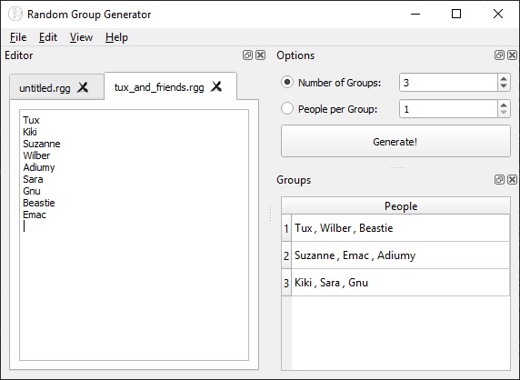

# Random Group Generator (0.3)

A cross-platform, free and open source random group generator.



## Features

- Generate random groups quickly and easily after specifying the number of groups or people per group

- Random Group Generator allows you to save and open files

- Customisable user interface thanks to [Qt's](https://www.qt.io/) QDockWidget.

## Installing

At this time, Random Group Generator is a source only distribution.

1. Make sure [Python](https://www.python.org/downloads) is installed. Both Python 3.7 and 3.8 have been tested.

2. Obtain the source code by cloning this repository and extract the files.

3. Open a shell (on Windows the Command Prompt or PowerShell) in the top level directory of the extracted Random Group Generator source tree.

4. On Linux and MacOS, run the following command:
   
   ```bash
   pip3 install -r requirements.txt
   ```
   
   On Windows, run the following command:
   
   ```bash
   pip install -r requirements.txt
   ```

## Running

To run Random Group Generator:

1. Open a shell in the top level directory of Random Group Generator.

2. On Linux and MacOS, run the following command:
   
   ```bash
   python3 -i main.py
   ```
   
   On Windows, run the following command:
   
   ```bash
   python -i main.py
   ```

### Another Method of Running Random Group Generator on Windows

1. Navigate to the top level directory of Random Group Generator.

2. Double click on `main.py`.

## Support

For support, please open an issue on GitLab.

## Todo

### Version 0.3

- [x] Change the GUI framework used to PyQt5
- [x] Make Random Group Generator more customizable (using QDockWidget)
- [ ] Create the CSS style sheets
- [ ] Add preferences
- [ ] Add the ability to import and export files
- [ ] Create a better icon
- [ ] Create binaries for Linux, MacOS and Windows

### Version 0.4

- [ ] Add a file system tree for quickly open files

## Contributing

Pull requests are welcome. For a feature request or bug, please open an issue on GitLab.

## Licence

Random Group Generator is released under the GNU General Public License v3.
